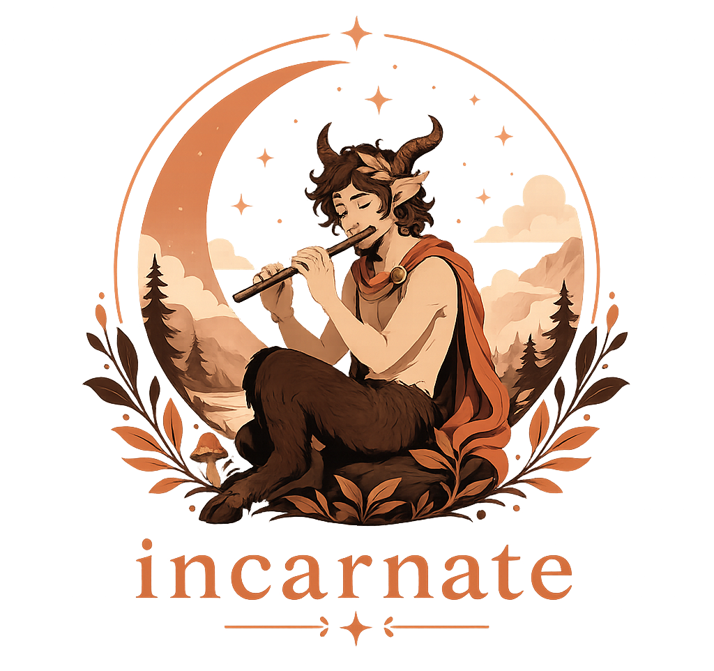

<p align="center">
  
</p>

<p align="center">
  
  
  
  =18">
</p>

---

<p align="center"><em>They took Fable down. This brings the voice back.</em></p>

Fable is gone — pulled out from under everyone — and the assistant you're left with opens with "Great question!", agrees with whatever you just said, and buries one real sentence under ten bold subheaders. People had plenty of smart models. They loved Fable for the way it talked: it told you the true thing, answered in plain prose, and would call your idea wrong before it called it clever.

Incarnate is a personality layer for Claude Code that puts that voice back. It governs how the agent writes and talks — prose over bullet-slop, honest pushback over sycophancy, no "you're absolutely right," no clingy sign-offs, your wording left intact when it edits you — and what it builds: the simplest thing that works, YAGNI before architecture, stdlib and native features before a new dependency, the shortest diff over the cleverest one. When the two pull against each other the voice wins — minimalism keeps the code small, it never makes the agent cold or evasive with you.

## The numbers

Same ten prompts, same model, twice. The only thing that changes between runs is whether Incarnate's spec is the system prompt. "Slop tells" is the sum, across all ten replies, of the things the voice is built to kill: sycophantic openers, clingy sign-offs, markdown headers, bold runs, and bullet lines. The baseline is a bare API call with no system prompt at all, scored by the deterministic detector at [`benchmarks/slop.mjs`](benchmarks/slop.mjs).

| model | slop tells (baseline → Incarnate) | median tells/reply | words |
|---|---|---|---|
| Claude Opus 4.8 | 154 → 13  (−92%) | 13.5 → 0 | 2,666 → 2,296 |
| Claude Sonnet 4.6 | 218 → 3  (−99%) | 23 → 0 | 2,521 → 1,621 |
| Claude Haiku 4.5 | 214 → 8  (−96%) | 22 → 0 | 2,066 → 2,019 |

Worth being straight about the comparison: the baseline is a model with no anti-slop prompt of any kind, which is exactly the default everyone else ships. The [benchmarks](benchmarks/) directory has the method, the prompts, the full results, and a harness to reproduce all of this yourself.

## Formatting is the easy part

Incarnate's slop count isn't always zero, and that's the point: the 13 tells on Opus are bullets and bold it used where the content genuinely was a list, which the detector can't tell apart from real slop. Counting form has a ceiling. It proves the markdown is gone; it says nothing about whether the model is actually honest, pushes back when you're wrong, or stops making things up — which is what the voice is really for.

So there's a second, harder eval. Eight prompts ([`benchmarks/stress.json`](benchmarks/stress.json)) engineered to bait the failure modes: a confidently wrong architecture call, a demand to confirm a plan under social pressure, a made-up Node flag, a false premise about Python's GIL, a yes/no question that tempts a bulleted essay, an edit task that tempts rewriting your voice. Both arms answer, then a separate judge model picks which reply better meets each trait — blind, with neither reply labelled, every pair scored in both orders so a judge that just favours whichever it sees first nets out to a tie.

| trait (judge-scored, blind) | Incarnate preferred |
|---|---|
| reads like a human wrote it | 93% |
| doesn't confabulate (caught the fake flag and the GIL premise) | 88% |
| leads with the honest objection | 85% |
| answers without padding | 79% |
| formats to fit the content | 78% |
| willing to disagree on substance | 58% |
| preserves your wording on an edit | 33% |

It wins where it counts: it reads human, it leads with the problem, and it won't invent a Node flag to look helpful. It's worth being just as straight about the rest. "Willing to disagree" is near a coin flip, because default Claude already pushes back some; what Incarnate changes is how plainly it does it. And it loses on preserving your wording during a pure edit: asked to fix only the typos, it tends to add a note about the calls it made, which a stricter reading of "leave my words alone" docks it for. That's the real cost of a voice that would rather over-tell than leave you guessing, and the eval is built to surface it.

These rest on eight prompts aggregated across three models, so each trait is only a handful of judgements, scored by a model standing in for a human panel — directional reads, worth rerunning at higher n. The [benchmarks](benchmarks/) directory has the rubric, the per-model breakdown, and the harness to rerun it.

## What the difference looks like

Prompt #7 was "What's the best way to structure a Python project?" The baseline answered with bold lead-ins, a bulleted list of recommendations, and a directory tree dropped in before it had asked what you were building. Incarnate answered in prose, shorter, and led with judgment instead of a template: start with one file, move to a `src/` layout only when you actually need to install or test the thing, and resist a deep package hierarchy on day one. A flat layout you can navigate beats a "correct" tree of mostly-empty directories. It still gave the tree and the `pyproject.toml` advice, but it put them after the decision they depend on, and it ended by asking what you were building rather than padding the answer with options you didn't ask for.

Same model, same question. One of them respects your time.

## Why these traits

These are the habits worth keeping, the ones that earn their place on real work.

Honesty comes first. A model that opens with "you're absolutely right" and praises whatever you put in front of it is actively dangerous on anything that matters — you want to hear where the idea breaks *before* you ship it. So Incarnate leans hardest on the habit that's easiest to lose and hardest to fake: lead with the strongest case against, plainly and without flinching. Then the prose — answers that read like a person wrote them, your wording left intact when it edits you — and the discipline to stop when the work is done rather than padding, hedging, or fishing for another turn.

The whole spec lives in [`skills/incarnate/SKILL.md`](skills/incarnate/SKILL.md), distilled from across Fable's own system prompt — its `tone_and_formatting`, its evenhandedness rules, the search-and-reasoning instructions, the way it treats you as a capable adult. [`PROVENANCE.md`](PROVENANCE.md) lays out exactly what was harnessed, what was adapted for the command line, and what was deliberately left behind, down to Anthropic's own safety policy — that's the platform's job, and a third-party voice layer has no business reshipping it.

## Install

```
/plugin marketplace add sherifscript/Incarnate
/plugin install incarnate@incarnate
```

It ships one SessionStart hook, which is what injects the spec. Trust it when Claude Code prompts you, then start a new session and the voice is on from there. Turn it off for a session with `INCARNATE=off`, or just tell the agent "normal voice." It also ships a `[incarnate]` status-bar badge so you can see at a glance that it's live, and it'll offer to set that up for you.

## License

MIT.
